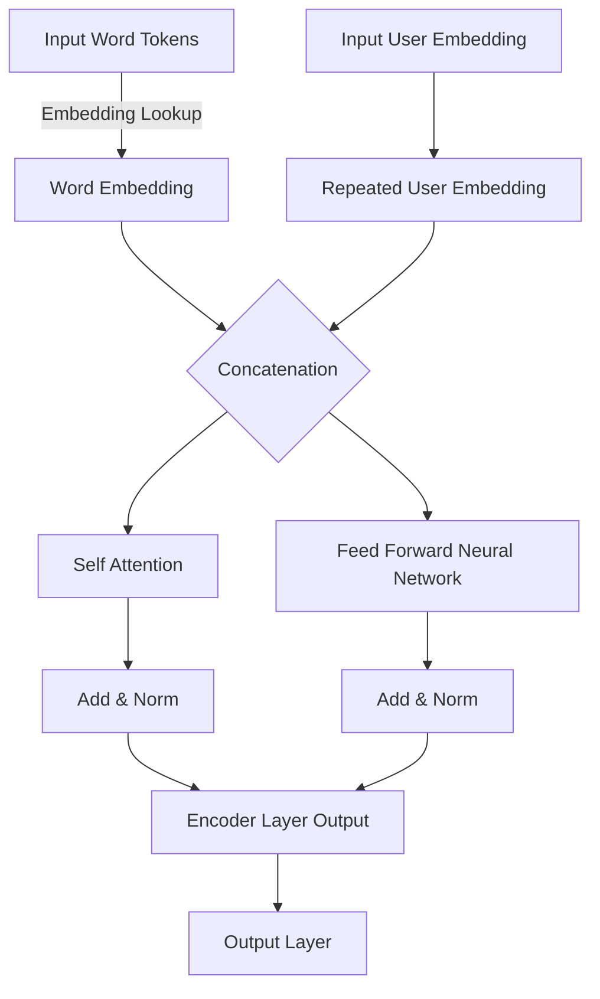
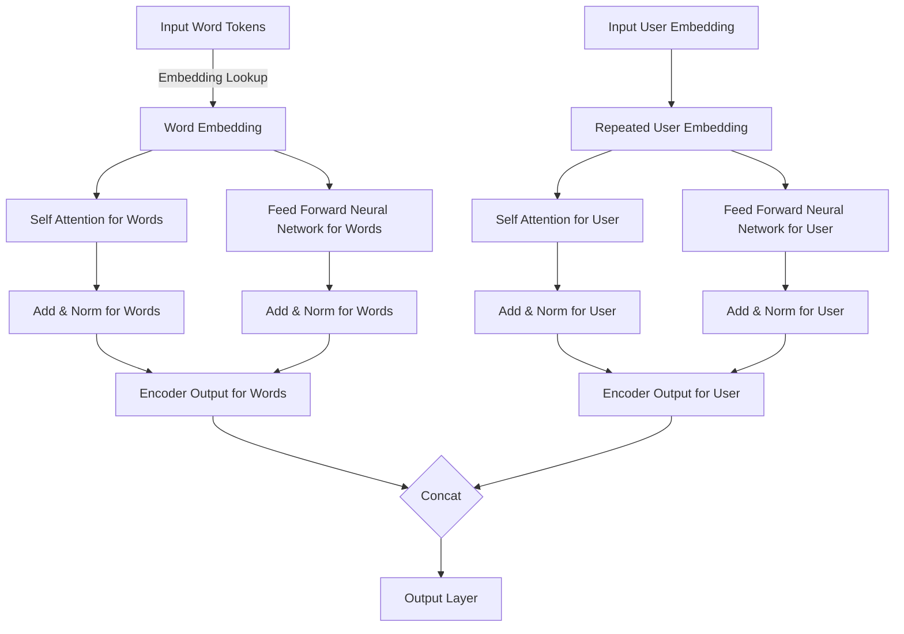

# Concat

```mermaid
graph TD
    A[Input Word Tokens] -->|Embedding Lookup| B[Word Embedding]
    C[Input User Embedding] --> D[Repeated User Embedding]
    B --> E{Concatenation}
    D --> E
    E --> F[Self Attention]
    F --> G[Add & Norm]
    E --> H[Feed Forward Neural Network]
    H --> I[Add & Norm]
    G --> J[Encoder Layer Output]
    I --> J
    J --> K[Output Layer]
```
---------------------

# Dual input

```mermaid
graph TD
    A[Input Word Tokens] -->|Embedding Lookup| B[Word Embedding]
    C[Input User Embedding] --> D[Repeated User Embedding]
    B --> E[Self Attention for Words]
    D --> F[Self Attention for User]
    E --> G[Add & Norm for Words]
    F --> H[Add & Norm for User]
    B --> I[Feed Forward Neural Network for Words]
    D --> J[Feed Forward Neural Network for User]
    I --> K[Add & Norm for Words]
    J --> L[Add & Norm for User]
    G --> M[Encoder Output for Words]
    K --> M
    H --> N[Encoder Output for User]
    L --> N
    M --> O{Concat}
    N --> O
    O --> P[Output Layer]
```